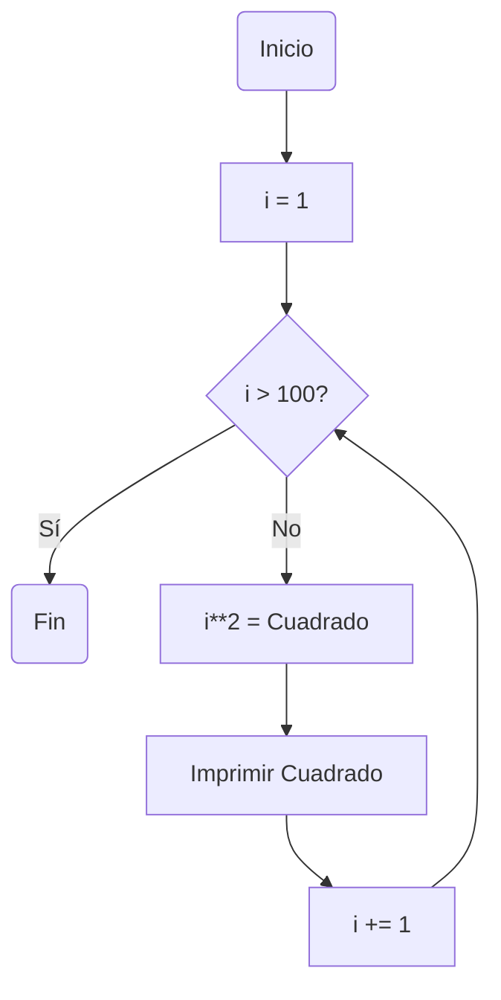
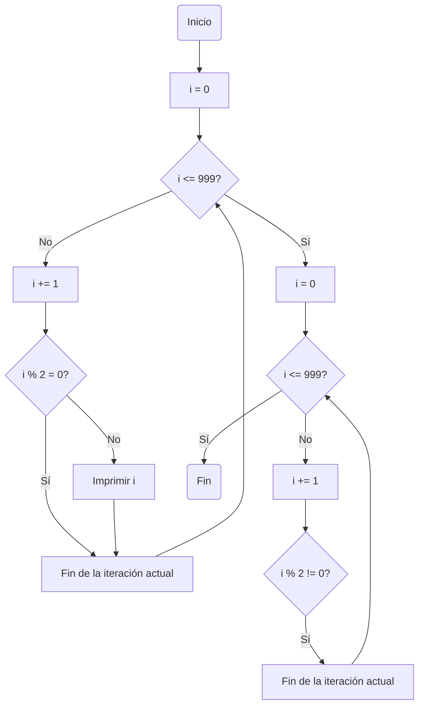
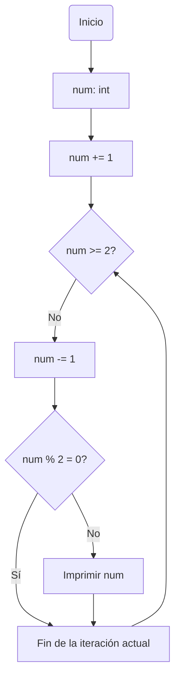

# Reto_7
## Ingenieros Megatroficos - Lucas García
[](https://postimg.cc/9D2jMgwD)
## Ejercicio 1
***
Imprimir un listado con los números del 1 al 100 cada uno con su respectivo cuadrado.
```
if __name__ == "__main__": # Función Main para iniciar el código
    
    # Declaro variables
    i: int
    cuadrado: int

    # Inicializo la variable para el ciclo
    i = 1 
    
    # El ciclo se repite para todo i menor o igual a 100
    while (i<=100):

        cuadrado = i**2 # Se calcula el cuadrado del número
        print(str(i),",",str(cuadrado)) # Se muestra cada número con su cuadrado
        i += 1 # Se actualiza aumentando en 1 el valor de i para que al repetirse el ciclo se tome el valor siguiente

    print("Fin") # Extra para delimitar el fin del código
```
### Diagrama de Flujo

## Ejercicio 2
***
Imprimir un listado con los números impares desde 1 hasta 999 y seguidamente otro listado con los números pares desde 2 hasta 1000.
```
if __name__ == "__main__": # Función Main para iniciar el código
    
    i: int # Declaro la variable

    print("Números impares:") # Señalización o título de la lista
    
    # Inicializo la variable para el ciclo
    i = 0 
    while(i <= 999) : # El ciclo se repite para todo i menor o igual a 999

        i += 1 # Se actualiza la variable para que tome el siguiente valor
        if (i % 2) == 0: # Si el módulo de i y 2 es igual a 0, osea es par, continua y no escribe dicho i
            continue
        print(str(i)) # Muestra al usuario la lista

    print("Números pares:") # Señalización o titulo de la lista

    # inicio la variable para el ciclo
    i = 0
    while(i <= 999) : # El ciclo se repite para todo i menor o igual a 999

        i += 1 # Se actualiza la variable para que tome el siguiente valor
        if (i % 2) != 0: # Si el módulo de i y 2 es diferente a 0, osea es impar, continua y no escribe dicho i
            continue
        print(str(i)) # Muestra al usuario la lista
```
### Diagrama de Flujo

## Ejercicio 3
***
Imprimir los números pares en forma descendente hasta 2 que son menores o iguales a un número natural n ≥ 2 dado.
```
if __name__ == "__main__": # Función Main para iniciar el código
    
    num = int(input("Digita un número")) # Se pide ingresar el valor de la variable

    # Se inicializa la variable para el ciclo
    num += 1
    while(num >= 2): # El ciclo se repite para todo num hasta llegar a ser igual a 2

        num -= 1 # Se actualiza la variable para que en la proxima iteración tome el valor menor a este
        if (num % 2) != 0: # Si el num es impar el ciclo continua pero omite la iteración actual
            continue
        print(num) # Se muestra el num en la terminal
```
### Diagrama de Flujo

## Ejercicio 4
***
En 2022 el país A tendrá una población de 25 millones de habitantes y el país B de 18.9 millones. Las tasas de crecimiento anual de la población serán de 2% y 3% respectivamente. Desarrollar un algoritmo para informar en que año la población del país B superará a la de A.
```
if __name__ == "__main__": # Función Main para iniciar el código

    # Se declaran las variables
    poblacion_A:float
    poblacion_B:float
    crecimiento_A:float
    crecimiento_B: float
    year:int

    # Se inicializan las variables para el ciclo
    poblacion_A = 25
    poblacion_B = 18.9
    year = 2022

    # El ciclo se repite hasta que la población del país B sea mayor a la del país A
    while(poblacion_A >= poblacion_B):
        
        # Se calcula el crecimiento de cada población
        crecimiento_A = poblacion_A * 0.02
        crecimiento_B = poblacion_B * 0.03
        
        # Se actualizan las variables con el crecimiento
        poblacion_A += crecimiento_A
        poblacion_B += crecimiento_B
        year += 1 # Se aumenta en 1 el año transcurrido
        
    # Se muestra el año en donde la población del país B supera a la del país A
    print("La población del país B superó a la del país A, en el año", str(year))
```
## Ejercicio 5
***
Imprimir el factorial de un número natural n dado.
```
if __name__ == "__main__": # Función Main para iniciar el código
    
    # Se declaran las variables
    num_anter: int
    factorial: int
    number = int(input("Ingrese un número")) # Se pide ingresar un valor para la variable

    # Para el caso especial de 0 se hace un if, ya que no cumple con la formula
    if number == 0: 
        print("Su factorial es 1")

    # En cualquier otro natural que no sea 0 se sigue el algoritmo
    else:
        # Se inicializan las variables para el ciclo
        number += 1
        num_anter = 1

        # El ciclo termina en 2 ya que multiplicar por 1 resulta en el mismo valor
        while(number > 1 ):

            # Se actualiza la variable para que en la proxima iteración tome el valor menor a este
            number -= 1

            # Se multiplica el numero actual por el anterior y se va "acumulando" la factorización
            factorial = number * num_anter 
            
            # Se iguala el num anterior a la factorización para que en la próxima iteración se siga acumulando
            num_anter = factorial

        print("Su factorial es:", str(factorial)) # Se muestra el valor del factorial del número ingresado
```
## Ejercicio 6
***
Implementar un algoritmo que permita adivinar un número dado de 1 a 100, preguntando en cada caso si el número es mayor, menor o igual.

  - La verdad no terminé de entender si la máquina tenía que adivinar el número que yo eligiese o viceversa, por ende hice ambos casos.

  ### Caso 1
  Donde tú adivinas el número que la máquina piensa:
```
    import random # Se importa el modulo para usarlo posteriormente

if __name__ == "__main__": # Función Main para iniciar el código

    # Se declaran las variables
    lim_inf: int
    lim_sup: int
    num_secret: int

    # Se inicializan las variables para el ciclo
    num_secret = random.randint(1,100) # Se genera el número aleatorio que se ha de adivinar
    acierto = False
    while (acierto == False): # El ciclo se repite hasta que la persona adivine el número
            
        intento = int(input("Intenta adivinar el número")) # Se ingresa el valor que el usuario crea posible

        # Para el caso en donde el número no siga las indicaciones y este fuera del intevalo
        if intento > 100 or intento < 1: 
            print("Es un número entre 1 y 100")
            continue
            
        # Para cuando finalmente se adivine el número y se termine el ciclo
        elif intento == num_secret:
            print("Lo lograste, acertaste!")
            acierto = True # Se actualiza la variable para poner fin al ciclo
                
        # Para cuando el número dado sea mayor al número por adivinar
        elif intento > num_secret:
            print("Te pasaste, es menor a ese")
            
        # Si ninguno de los anteriores se cumple se da el caso de que el número dado es menor al número por adivinar
        else:
            print("No, el número es mayor a este")
```
  ### Caso 2
  Donde máquina adivina el número que la tú piensas:
```
    import random # Se importa el modulo para usarlo posteriormente

    if __name__ == "__main__": # Función Main para iniciar el código

        # Se muestran las instrucciones básicas
        print("Piensa en un número, trataré de adivinarlo")
        print("Por favor responde a cada pregunta con \"Si\" o \"No\"")
    
        # Se declaran las variables
        lim_inf: int
        lim_sup: int
        suposicion: int
    
        # Se inicializan las variables para el ciclo
        lim_inf = 1
        lim_sup = 100
        suposicion = random.randint(lim_inf,lim_sup)
        acierto = False
    
        # El ciclo se repite hasta que la adivinanza haya acertado
        while (acierto == False):
            
            # Pregunta si tu número es mayor a uno que se genera al azar con los límites dados
            print("¿Tu número es mayor a:", str(suposicion), "?") 
            respuesta = str(input())
            match respuesta:
                case "Si":
                    lim_inf = suposicion # actualiza el límite inferior
                case "No":
                    lim_sup = suposicion # actualiza el límite superior
    
                # En caso de digitar un valor incorrecto se despliega el sgte mensaje
                case _:
                    print("Respuesta inválida")
            suposicion = random.randint(lim_inf,lim_sup) # Se crea otra suposición con los nuevos límites
    
            # Pregunta si tu número es menor a uno que se genera al azar con los límites dados
            print("¿Tu número es menor a:", str(suposicion), "?")
            respuesta = str(input())
            match respuesta:
                case "Si":
                    lim_sup = suposicion # actualiza el límite superior
                case "No":
                    lim_inf = suposicion # actualiza el límite inferior
                
                # En caso de digitar un valor incorrecto se despliega el sgte mensaje
                case _:
                    print("Respuesta inválida")
            suposicion = random.randint(lim_inf,lim_sup) # Se crea otra suposición con los nuevos límites
    
            # Pregunta si tu número es igual a uno que se genera al azar con los límites dados
            print("¿Tu número es igual a:", str(suposicion), "?")
            respuesta = str(input())
    
            # Si se da el caso de que sean iguales, se actualiza la variable y se termina el ciclo
            if respuesta == "Si":
                acierto = True 
    
            # Se crea otra suposición con los nuevos límites por si no se ha terminado el ciclo
            suposicion = random.randint(lim_inf,lim_sup)
                
        print("Ja!, lo logré, tu número es:", str(suposicion)) # Celebración de la máquina
```
## Ejercicio 7
***
Implementar un programa que ingrese un número de 2 a 50 y muestre sus divisores.
```
if __name__ == "__main__": # Función Main para iniciar el código

  # Se declaran las variables
  n = int
  modulo = int
  dato = int(input("Ingresa un valor entre 2 y 50")) # Se ingresa el valor pedido

  # Para el caso en donde se ingrese un valor dentro del intervalo especificado
  if dato > 1 and dato < 51:

    print("El número:", str(dato), "tiene como divisores a:") # Se muestra un "título" para la lista

    # Se inicializa la variable para el ciclo
    n = 1
    while (n <= dato): # El ciclo se repite hasta que n sea mayor que el valor dado
        modulo = dato % n

        # Si el módulo es igual a 0 significa que es un divisor y por ende se imprime
        if modulo == 0:
          print(str(n))
  n += 1 # se suma 1 al valor de n para que se sigan obteniendo los divisores dentro del ciclo
    
  # Para el caso en donde se ingrese un valor fuera del intervalo especificado
  else:
    print("No es un número que esté en el intervalo que te pedí")
```
## Ejercicio 8
***
Implementar el algoritmo que muestre los números primos del 1 al 100. Nota: use funciones
```
# Se declaran las funciones a utilizar dentro del codigo
def modulo (valor: int, i: int) -> int: # Se declaran las variables que ingresan y las que salen
    modulando = valor%i
    return modulando # Se devuelve el valor del módulo de las 2 variables

def primo (valor: int, i: int) -> bool: # Se declaran las variables que ingresan y las que salen
    
    # El ciclo se repite hasta que el número sea igual a i
    while(valor > i):
        residuo = modulo(valor,i) # Llama a la funcion "modulo" para obtener dicho valor
        
        if residuo == 0: # Si el módulo es igual a 0 el valor no es primo y se termina el ciclo
            primeidad = False
            break # Rompe el ciclo, evitando la iteracion actual y las siguientes
        i += 1 # Se le aumenta el valor a i en 1 para que se obtenga el módulo próximo
        primeidad = True

    return primeidad # Se devuelve un booleano que indica si el valor es primo o no

if __name__ == "__main__": # Función Main para iniciar el código
    
    # Se declaran las variables
    valor: int
    i: int
    
    print("La lista de números primos del 1 al 100 es:") # Se muestra un "título" para la lista
    print("2") # Se agrega el 2 a la lista pues ya se sabe que es un número primo entre 1 y 100
    
    # Se inicializan las variables para el ciclo
    valor = 3
    i = 2

    while (valor <= 100): # El ciclo se repite hasta que el valor sea mayor a 100
        
        # Se llama a la funcion "primo" para verificar si el valor es primo o no
        es_primo = primo(valor,i)
        if es_primo == True:
            print(str(valor)) # Si el valor es primo se imprime

        valor += 1 # Se le suma 1 al valor para en la próxima iteración se verifique el número siguiente
        i = 2 # Se actualiza el valor de i al inicial para que en la próxima iteración comience desde 2
```
